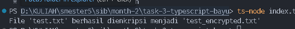
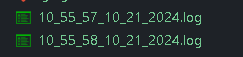
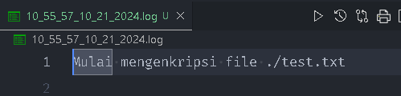
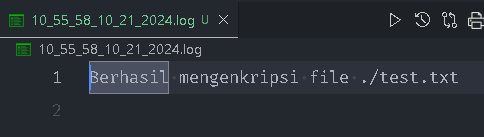
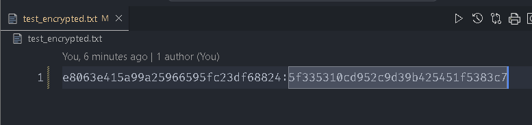
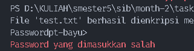
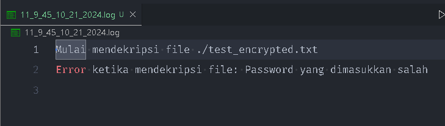

# Task 3 NodeJS, Async Function, ES Module, Error Handling

## Deskripsi tugas
membuat aplikasi NodeJS yang melakukan enkripsi dan
dekripsi file menggunakan modul Crypto dengan TypeScript. Aplikasi ini
juga harus menangani proses file system dan path file secara
asynchronous, dengan error handling yang baik.

## Fitur
1. Enkripsi File: Menerima path file dan menghasilkan file terenkripsi
dengan password.
2. Dekripsi File: Menerima file terenkripsi dan menghasilkan file asli.
3. Logging: Semua aktivitas dicatat ke file log.

## Perintah untuk mengeksekusi
- **Encrypt file**
   ```sh
   ts-node index.ts encrypt ./test.txt myPassword

- **Decrpyt file**
   ```sh
   ts-node index.ts decrypt ./test_encrypted.txt myPassword

- **Encrypt file menggunakan password yang tidak valid**
   ```sh
   ts-node index.ts decrypt ./test_encrypted.txt wrongPassword


## Eksekusi Aplikasi
- [EncryptFile] 
   Jalankan perintah
   ```sh
   ts-node index.ts encrypt ./test.txt myPassword

untuk Encrypt file test.txt
output:

kemudian proses yang terjadi akan masuk ke file log dengan format:[(jam)_(menit)_(detik)_(bulan)_(tanggal)_(tahun).log]

isi log:



kemudian akan menghasilkan satu file dengan nama test_encrypt.txt yang berisi hasil encrypt:


- [DecryptFile] 
   Jalankan perintah
   ```sh
   ts-node index.ts decrypt ./test_encrypted.txt myPassword

- [EncryptFilePasswordSalah] 
   Jalankan perintah
   ```sh
   ts-node index.ts decrypt ./test_encrypted.txt wrongPassword

maka akan menghasilkan output:

dan menghasilkan log dengan pesan


## Done


